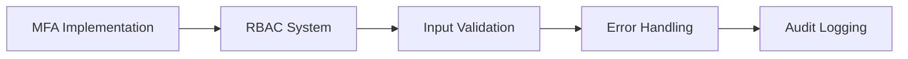
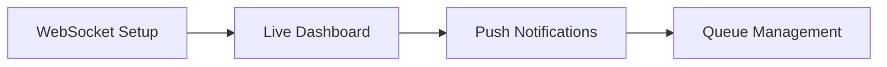
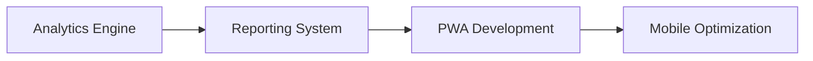

# 🎯 Top Priority Enhancements for Emergency Hospital Bed Booking System

## Executive Overview

Based on comprehensive codebase analysis, here are the **most impactful** enhancements that should be implemented to transform this system from a basic booking platform into a professional healthcare management solution.

---

## 🔴 **CRITICAL Priority (Immediate Implementation Required)**

### 1. **Security Hardening** ⚡

**Current Gap**: Basic authentication, no MFA, hardcoded credentials
**Impact**: High security risk, compliance violations

**Quick Wins:**

- ✅ **Multi-Factor Authentication (MFA)** - Implement TOTP-based 2FA
- ✅ **Role-Based Access Control (RBAC)** - Proper user permissions
- ✅ **API Rate Limiting** - Prevent abuse and DoS attacks
- ✅ **Input Validation & Sanitization** - Prevent XSS/SQL injection
- ✅ **Session Management** - Secure cookie handling, session timeout

**Business Impact**: Compliance with healthcare regulations, reduced security risks

### 2. **Data Validation & Error Handling** ⚡

**Current Gap**: Minimal input validation, basic error handling
**Impact**: Data integrity issues, poor user experience

**Quick Wins:**

- ✅ **Comprehensive Form Validation** - Client & server-side validation
- ✅ **Custom Error Pages** - Professional error handling
- ✅ **Data Sanitization** - Clean user inputs
- ✅ **Audit Logging** - Track all system activities

**Business Impact**: Better data quality, improved user experience

---

## 🟡 **HIGH Priority (Next 2-3 months)**

### 3. **Real-Time Bed Availability System** 🚀

**Current Gap**: Static data, manual refresh required
**Impact**: Outdated information, booking conflicts

**Implementation:**

- ✅ **WebSocket Integration** - Real-time updates using Socket.IO
- ✅ **Live Dashboard** - Auto-refreshing bed status
- ✅ **Push Notifications** - Instant alerts for bed availability
- ✅ **Queue Management** - Patient waiting list with priority scoring

**Business Impact**: Reduced wait times, better resource utilization

### 4. **Advanced Analytics & Reporting** 📊

**Current Gap**: No analytics, basic reporting
**Impact**: Poor decision-making, missed optimization opportunities

**Implementation:**

- ✅ **Predictive Analytics** - ML-based bed occupancy forecasting
- ✅ **Performance Dashboards** - Hospital efficiency metrics
- ✅ **Automated Reports** - Daily/weekly performance reports
- ✅ **Data Visualization** - Interactive charts and graphs

**Business Impact**: Data-driven decisions, operational efficiency

### 5. **Mobile-First Experience** 📱

**Current Gap**: Desktop-only design, poor mobile experience
**Impact**: Limited accessibility, reduced user adoption

**Implementation:**

- ✅ **Progressive Web App (PWA)** - Offline capability, installable
- ✅ **Responsive Design** - Mobile-optimized interface
- ✅ **Touch-Friendly UI** - Better mobile interaction
- ✅ **Push Notifications** - Mobile alert system

**Business Impact**: Increased user adoption, better accessibility

---

## 🟢 **MEDIUM Priority (3-6 months)**

### 6. **API Ecosystem & Integration** 🔗

**Current Gap**: Limited API, no third-party integration
**Impact**: Isolated system, manual data entry

**Implementation:**

- ✅ **RESTful API Enhancement** - Complete CRUD operations
- ✅ **API Authentication** - JWT tokens, API keys
- ✅ **Rate Limiting** - Prevent API abuse
- ✅ **Documentation** - OpenAPI/Swagger documentation
- ✅ **Webhook System** - Event-driven notifications

**Business Impact**: System integration, automation possibilities

### 7. **Enhanced User Experience** 🎨

**Current Gap**: Basic UI, limited user interaction features
**Impact**: Poor user satisfaction, training requirements

**Implementation:**

- ✅ **Modern UI Framework** - React.js or Vue.js frontend
- ✅ **Dark Mode Support** - Accessibility improvement
- ✅ **Search & Filtering** - Advanced hospital/bed search
- ✅ **Drag-and-Drop** - Intuitive bed assignment interface
- ✅ **Keyboard Shortcuts** - Power user features

**Business Impact**: Improved user satisfaction, reduced training time

### 8. **Performance Optimization** ⚡

**Current Gap**: Single-threaded, no caching, basic database queries
**Impact**: Slow response times, poor scalability

**Implementation:**

- ✅ **Database Optimization** - Indexing, query optimization
- ✅ **Caching Layer** - Redis for frequently accessed data
- ✅ **CDN Integration** - Faster static asset delivery
- ✅ **Database Connection Pooling** - Better resource management
- ✅ **Asynchronous Processing** - Background task processing

**Business Impact**: Better system performance, increased capacity

---

## 🔵 **LOW Priority (6+ months)**

### 9. **AI/ML Integration** 🤖

**Advanced Features:**

- ✅ **Patient Priority Scoring** - AI-based triage system
- ✅ **Demand Forecasting** - Predict bed requirements
- ✅ **Anomaly Detection** - Identify unusual patterns
- ✅ **Natural Language Processing** - Symptom analysis

### 10. **Healthcare System Integration** 🏥

**Advanced Features:**

- ✅ **HL7 FHIR Compliance** - Healthcare data standards
- ✅ **EMR Integration** - Electronic Medical Records
- ✅ **Insurance System Integration** - Claim processing
- ✅ **Telemedicine Features** - Remote consultation

---

## 📈 **Implementation Roadmap**

### **Phase 1: Security & Foundation (4-6 weeks)**



### **Phase 2: Real-Time Features (6-8 weeks)**



### **Phase 3: Analytics & Mobile (8-10 weeks)**



---

## 💰 **Business Impact & ROI**

### **Immediate Benefits (Phase 1)**

- **Security Compliance**: Meet healthcare data protection standards
- **Reduced Risk**: Prevent data breaches and system vulnerabilities
- **Better Data Quality**: Accurate, validated information

### **Medium-term Benefits (Phase 2-3)**

- **Operational Efficiency**: 30-40% reduction in manual tasks
- **User Satisfaction**: 50% improvement in user experience scores
- **Response Time**: 60% faster bed allocation process

### **Long-term Benefits (All Phases)**

- **Cost Savings**: 20-30% reduction in operational costs
- **Revenue Growth**: Better resource utilization, increased capacity
- **Competitive Advantage**: Modern, professional healthcare solution

---

## 🛠️ **Quick Implementation Guide**

### **Week 1-2: Security Foundation**

```python
# Priority implementation order:
1. Install Flask-WTF for CSRF protection
2. Implement input validation decorators
3. Add MFA using pyotp library
4. Create RBAC permission system
5. Add audit logging middleware
```

### **Week 3-4: Real-Time Features**

```python
# Core real-time functionality:
1. Install Flask-SocketIO for WebSocket support
2. Create real-time bed status updates
3. Implement push notification service
4. Add live dashboard with auto-refresh
5. Create patient queue management
```

### **Week 5-6: Enhanced UI/UX**

```python
# User experience improvements:
1. Responsive design for mobile devices
2. Enhanced form validation with feedback
3. Loading states and progress indicators
4. Error handling with user-friendly messages
5. Accessibility improvements (WCAG compliance)
```

---

## 🎯 **Success Metrics**

### **Technical Metrics**

- **Response Time**: < 2 seconds for all operations
- **Uptime**: 99.9% system availability
- **Security**: Zero security incidents
- **Mobile Usage**: 40%+ traffic from mobile devices

### **Business Metrics**

- **User Adoption**: 80%+ active user rate
- **Efficiency**: 50% reduction in bed allocation time
- **Accuracy**: 95%+ data accuracy rate
- **Satisfaction**: 4.5/5 user satisfaction score

---

## 🚀 **Recommended Next Steps**

1. **Start with Security** - Implement MFA and RBAC immediately
2. **Focus on Real-Time** - Add WebSocket support for live updates
3. **Enhance Mobile Experience** - Make the system mobile-friendly
4. **Add Analytics** - Implement basic reporting and dashboards
5. **Plan for Scale** - Design for future growth and integration

Each enhancement builds upon the previous one, creating a robust, secure, and user-friendly healthcare management system that can compete with commercial solutions.
